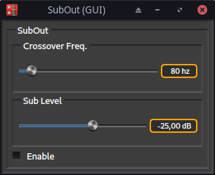
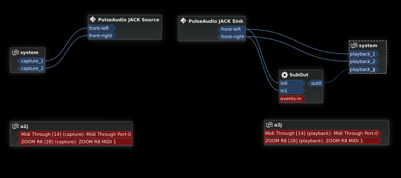

# Subout Plugin

Stereo audio in to low frequency summed mono audio out.

Mono output carries low-freq part of summed-to-mono stereo input signal,
which then can be sent to a hardwaro audio output connected to a sub-woofer
speaker.

## Build

* Install FAUST and LV2 headers
* Run `./compile.sh`

    Add the `-qui` command line option, if you want to enable the standard
    FAUST custom plugin UI (note: the custom UI may not work in some LV2
    hosts, just use the host-generated UI instead).

## Install

* Run `./install.sh` to install the `subout.lv2` plugin to `~/.lv2`

    The installation directory can be changed by setting the `USER_LV2_DIR`
    environment variable.
